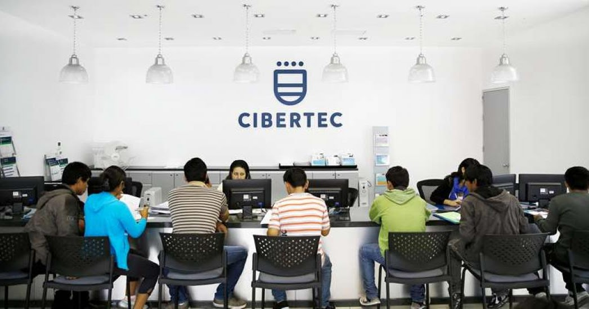

  
   

  <h3><b>Introduction to Algorithmics (Spanish) - Java</b></h3>
  <h3>Picture : Cibertec Classroom</h3>

<!-- TABLE OF CONTENTS -->

# 📗 Table of Contents

- [📖 About the Course](#about-project)
  - [🛠 Built With](#built-with)
    - [Tech Stack](#tech-stack)
    - [Key Features](#key-features)
- [💻 Getting Started](#getting-started)
  - [Setup](#setup)
  - [Prerequisites](#prerequisites)
  - [Install](#install)
  - [Usage](#usage)
  - [Deployment](#deployment)
- [👥 Authors](#authors)
- [🔭 Future Features](#future-features)
- [🤝 Contributing](#contributing)
- [⭐️ Show your support](#support)
- [🙏 Acknowledgements](#acknowledgements)
- [❓ FAQ (OPTIONAL)](#faq)

<!-- PROJECT DESCRIPTION -->

# 📖 [Introduction to Algorithmics - Java (Spanish Version)] 

> Brief description of the course.

**[Introduction to Algorithmics - Java (Spanish Version)]** is a course in where you will find useful material related to algorithmics and OOP basic concepts. This material is in SPANISH because was made in an Institute from Perú (South America).

## 🛠 You will work with 

### Tech Stack : 

  
IDE

  <ul>
    <li><a href="">Eclipse</a></li>
  </ul>

Database

  <ul>
    <li><a href="">MySql</a></li>
  </ul>

<!-- Features -->

### Key Features 

> Key features of the application.

- **[key_feature_1]**
- **[key_feature_2]**
- **[key_feature_3]**

(<a href="#readme-top">back to top</a>)

<!-- GETTING STARTED -->

## 💻 Getting Started 

> As a new developer you should follow these instructions.

### Prerequisites

In order to practice the theory of this course you need:

 - Eclipse IDE

### Setup

You can download Eclipse from its main site, but try to get and specific version like the one being used on the theory files.

### Install

You will need to install Eclipse for Java Developers, other versions are for different courses.

### Usage

No need extra tools, this course is meant for theory, but in the practice you will have to rather follow the documentation or just try to play with the code.

### Deployment

You can deploy this project using:

 - Eclipse.

(<a href="#readme-top">back to top</a>)

<!-- AUTHORS -->

## 👥 Authors 

> Collaborators of this project.

👤 **Juan Diego Guerra**

- GitHub: [@JuanDiegoGuerra](https://github.com/JuanDiegoGuerra)
- Facebook: [JuanDiegoGuerra FB](https://www.facebook.com/jdx.elric/?locale=es_LA)
- LinkedIn: [JD LinkedIn Profile](https://www.linkedin.com/in/juan-guerra-65076b1ba/)
  
👤 **Technological Institute Cibertecc**

- Instagram: [Cibertec Oficial IG](https://www.instagram.com/cibertecoficial/?hl=es)
- Facebook: [Cibertec Oficial FB](https://www.facebook.com/cibertecoficial/?locale=es_LA)
- LinkedIn: [Cibertec Peru](https://www.linkedin.com/school/cibertec/?original_referer=https%3A%2F%2Fwww%2Egoogle%2Ecom%2F&originalSubdomain=pe)

(<a href="#readme-top">back to top</a>)

<!-- FUTURE FEATURES -->

## 🔭 Future Features 

> features I will add to the project.

- [ ] **[TBA]**
- [ ] **[TBA]**
- [ ] **[TBA]**

(<a href="#readme-top">back to top</a>)

<!-- CONTRIBUTING -->

## 🤝 Contributing 

Contributions, issues, and feature requests are welcome!

Feel free to check the [issues page](../../issues/).

(<a href="#readme-top">back to top</a>)

<!-- SUPPORT -->

## ⭐️ Show your support 

> You can support following me.

 - If you like this project you can follow me 🤩! I will be adding more useful material 😁.

(<a href="#readme-top">back to top</a>)

<!-- ACKNOWLEDGEMENTS -->

## 🙏 Acknowledgments 

> Credits to:

I would like to thank CIBERTEC, Institute of Technology, for making this course.

(<a href="#readme-top">back to top</a>)

<!-- FAQ (optional) -->

## ❓ FAQ (OPTIONAL) 

> Add at least 2 questions new developers would ask when they decide to use your project.

- **[TBD]**

  - [TBD]

- **[TBD]**

  - [TBD]

(<a href="#readme-top">back to top</a>)

